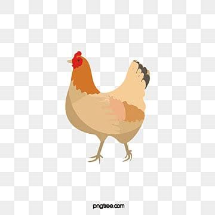

# Noodles-YSWS-submission


## About
A top to bottom slideshow of a chicken's lifespan made with GSAP for HackClub's Noodles YSWS

## How it works
We have 3 main files:

- index.html : The main HTML lives here.
- style.css : For CSS styles and structural layouts.
- main.js : For the logic and GSAP scroll animations.

### index.html
Our mainlayout uses a slide <div> element configured like this:

```html
<div class="slide" data-bg="#fff0e0">
  <div class="slide-inner">
    <p class="slide-credit">subtitle goes here</p>
    
    <p class="slide-text">
      slide text goes here
    </p>
  </div>
</div>
```

Theres also a mascot (idk how to describe it) popout thing:

```html
<div id="mascot" class="mascot">
  
  <div id="mascot-bubble" class="mascot-bubble"></div>
</div>
```

It slides in from the right with a fun fact whenever you land on a new slide, then slides back out after a bit. Fun Facts are stored in the FunFacts array in the main.js file

### style.css
originally I had planned to use tailwind.css but I couldnt get it ro run properly so I used regular css
The css is pretty self explanatory with styles for the bg , slides ,progress dots and Mascot/popout


### main.js 
Uses gsap code to make a top to bottom slideshow. We use a basic circular queue method here for changing current slide. Scroll position gets umm 'teleported' (ig?) back near the top/bottom to fake an infinite scroll, with ScrollTrigger temporarily disabled during the jump so it doesn't get stuck
looping on itself. As for the Audio/bg musics, we utalize the <audio> element from the index.html file then do the following make a simple toggle button using boolean logic:

```Javascript
const music = document.getElementById("bg-music");
const soundToggle = document.getElementById("sound-toggle");
let on = false;
soundToggle.addEventListener("click", () => {
  on = !on; 
  if (on) {
    music.play();
    soundToggle.innerHTML = "🔊";

  }

  else {
    music.pause();
    soundToggle.innerHTML = "🔈";
      soundToggle.textContent = "🔇";

  }
});
```

#### NOTE: AI was used to help make the gsap animations and helped with some (not all) logic. NO CONTENT IN THIS README WAS MADE WITH AI

